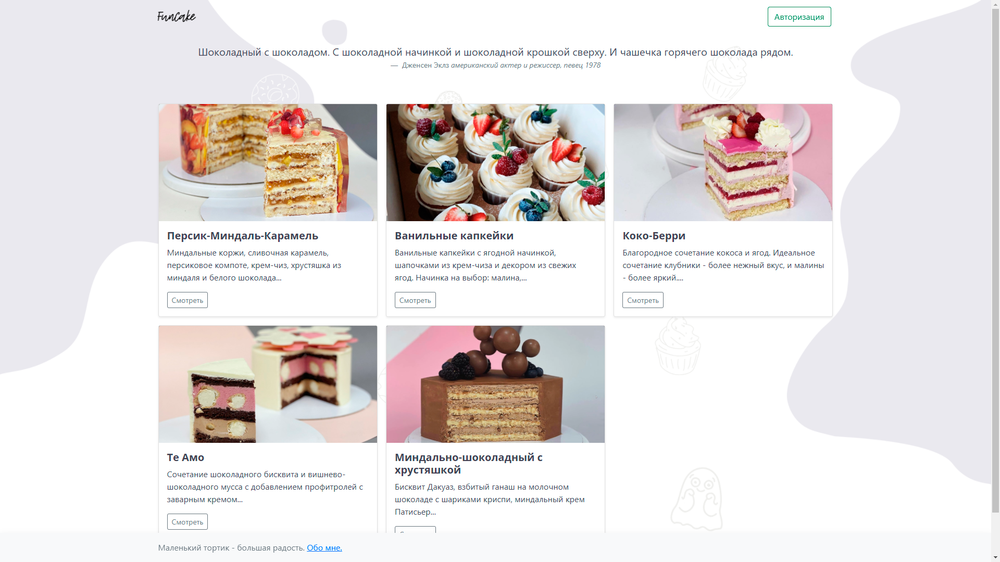
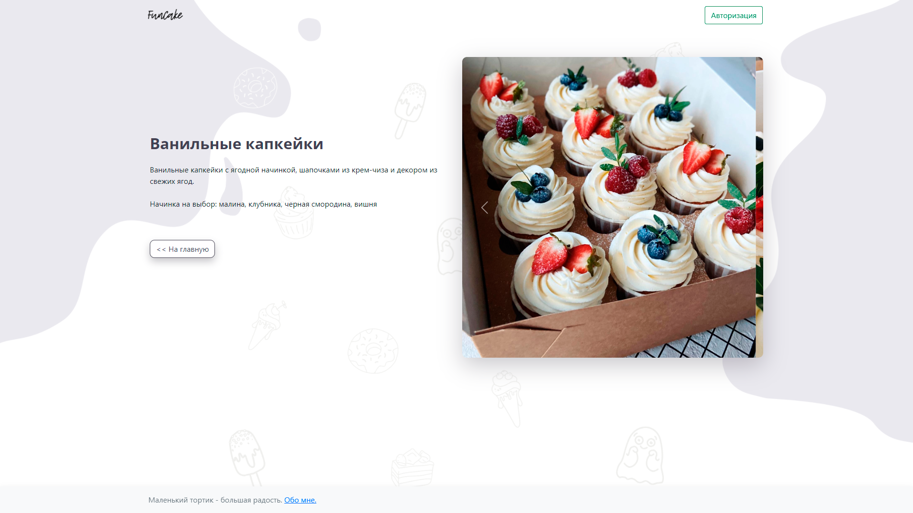
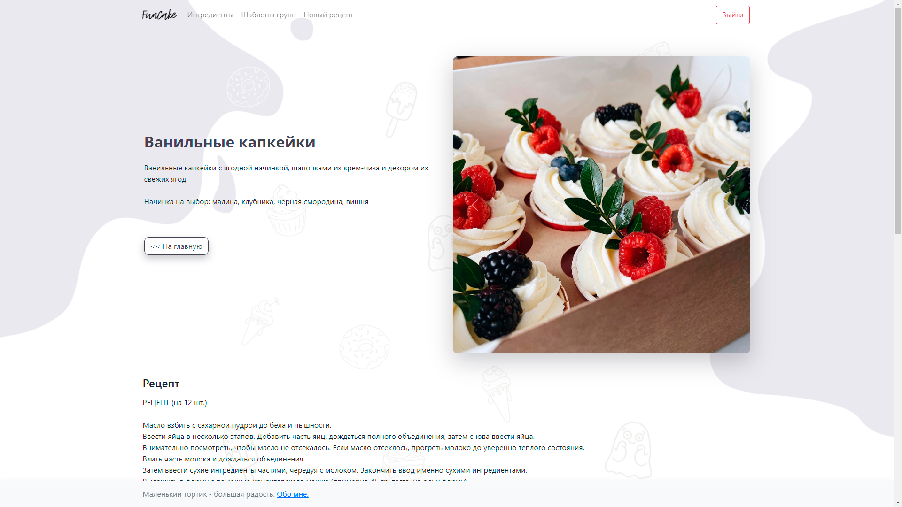
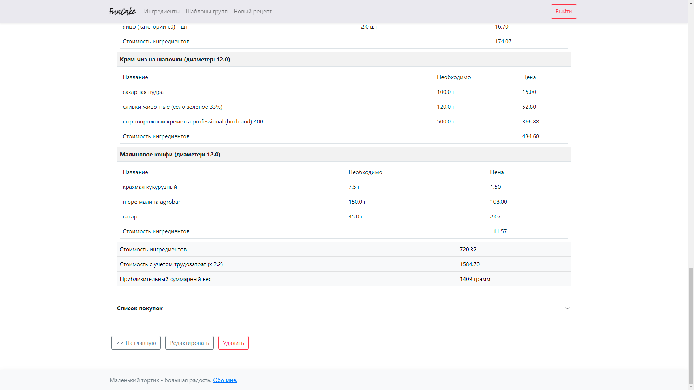
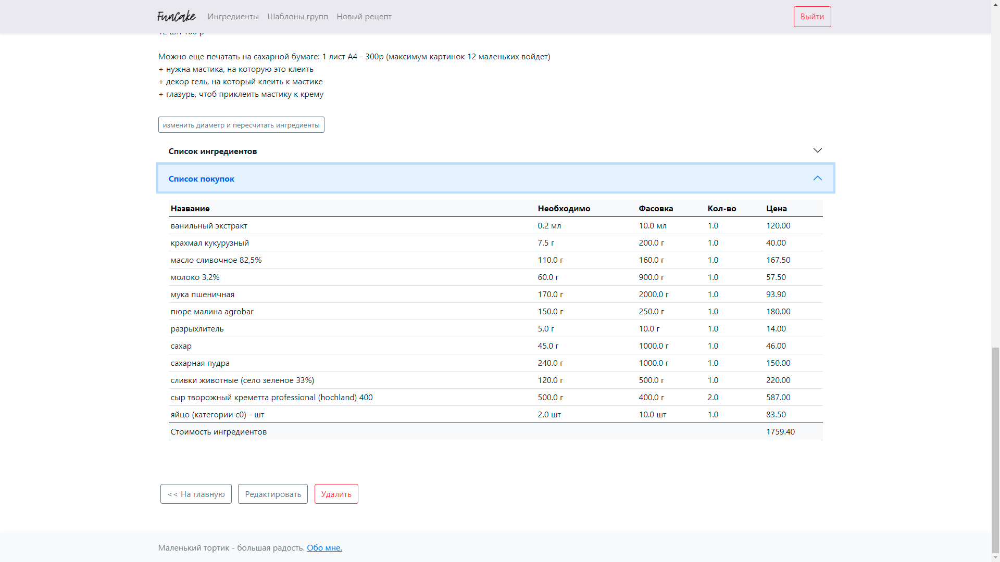
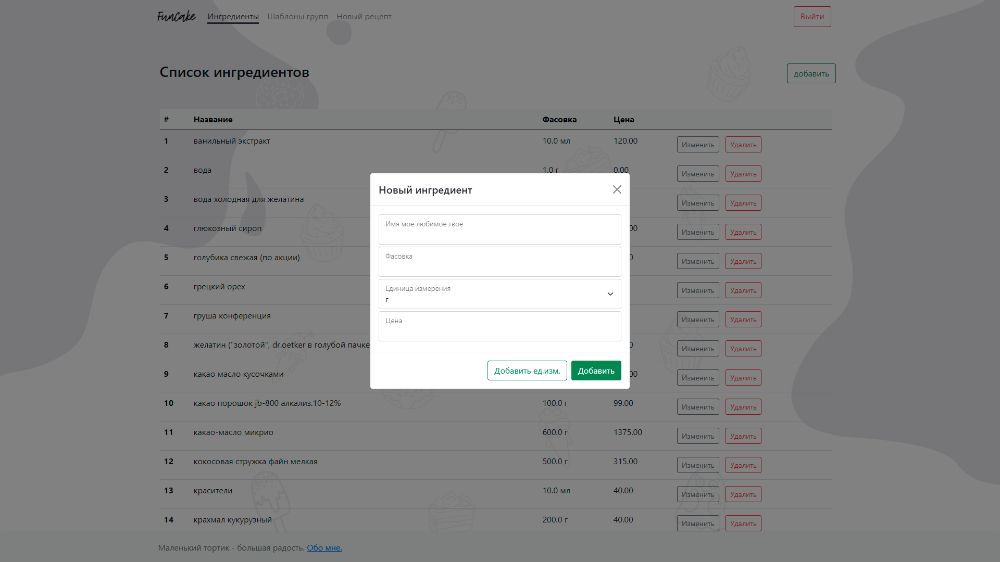
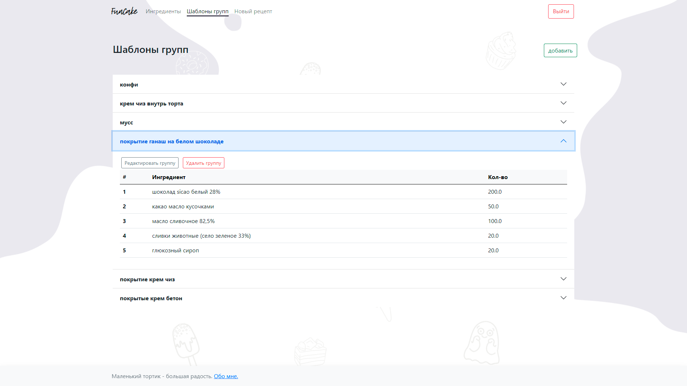
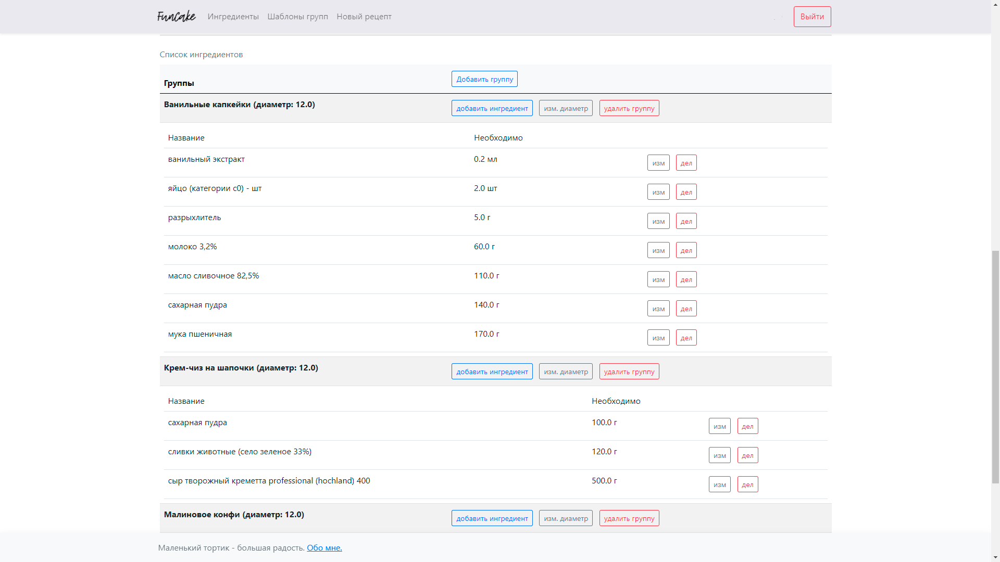

# старт 

установить библиотеки
```
python -m pip install -r requirements.txt
or
pip install -r requirements.txt 
```
запустить
```
python wsgi.py
```
<a href="http://127.0.0.1:5000/">и открыть в браузере</a>

или в живую
<a href="https://fun-cake.ru/">fun-cake.ru</a>


## task

- [x] список рецептов и отображение внутри (разграничение по авторизации)
- [x] список ингредиентов с ценой и фасовкой
- [x] состав рецепта с учетом цены ингердинтов и кол-ва => себестоимость рецепта по кол-ву
- [x] пересчет ингрединтов (кол-ва и цены) для нового диаметра
- [x] список покупок для рецепта (с учетом фасовки)
- [x] шаблоны для слоев в рецепте
- [ ] оптимизация картинок при загрузке
- [ ] список заказчиков


### как это выглядит








